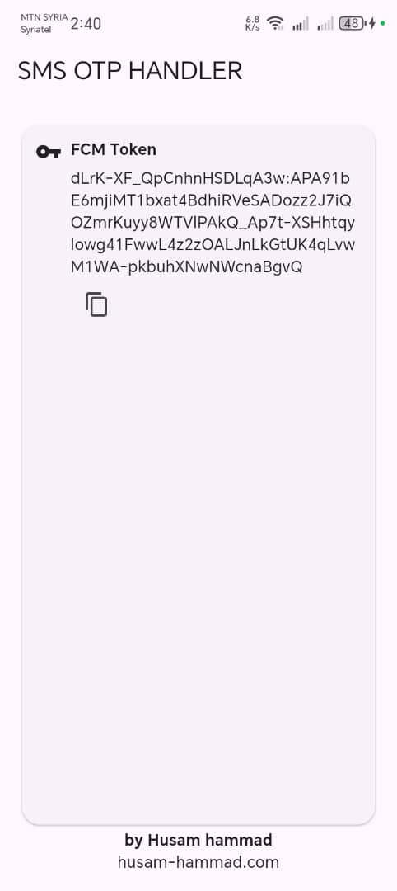

# smsotp (com.husamhammd.smsotp)

> **المهمة:** قم بإرسال رسائل OTP من هاتفك دون الحاجة لشركات الاتصال.



واجهة أندرويد مبنية بفلتر تتلقّى **إشعارات FCM (data-only)**، وتُرسل **SMS** تلقائيًا عبر `SmsManager` حتى في الخلفية، مع شاشة رئيسية لعرض **FCM Token** (زر نسخ) وسجلّ الطلبات (GetStorage).

---

## المحتويات

- [المزايا](#المزايا)
- [كيف يعمل؟](#كيف-يعمل)
- [المتطلبات](#المتطلبات)
- [إعداد Firebase](#إعداد-firebase)
- [تطابق اسم الحزمة](#تطابق-اسم-الحزمة)
- [وضع ملف google-servicesjson](#وضع-ملف-google-servicesjson)
- [تهيئة أندرويد (Gradle و Dependencies)](#تهيئة-أندرويد-gradle-و-dependencies)
- [الأذونات (AndroidManifest)](#الأذونات-androidmanifest)
- [تصريح خدمة FCM الخلفية](#تصريح-خدمة-fcm-الخلفية)
- [تهيئة Flutter (token ثابت وتمريره للشاشة)](#تهيئة-flutter-token-ثابت-وتمريره-للشاشة)
- [إرسال تجريبي عبر Postman](#إرسال-تجريبي-عبر-postman)
- [إشعارات محلية (اختياري)](#إشعارات-محلية-اختياري)
- [التخزين والمزامنة](#التخزين-والمزامنة)
- [نصائح مهمّة](#نصائح-مهمّة)
- [تشغيل المشروع](#تشغيل-المشروع)
- [لقطة شاشة](#لقطة-شاشة)
- [الترخيص/الحقوق](#الترخيصالحقوق)

---

## المزايا

- استقبال **data-only FCM** وتشغيل منطق الخلفية فورًا.
- إرسال **SMS** تلقائيًا عبر `SmsManager` (بدون فتح أي واجهة).
- عرض **FCM Token** في بطاقة مع **زر نسخ**.

---

## كيف يعمل؟

- **الخلفية:** تصل رسالة FCM (data-only) → `BgFcmService` (Kotlin) تلتقطها → ترسل SMS عبر `SmsManager` → تُسجِّل المهمة محليًا.
- **الواجهة (Foreground):** إن وصلت FCM أثناء فتح التطبيق، يتم التعامل معها في Dart (مثل عرض إشعار محلي واستدعاء إرسال يدوي إن رغبت).

---

## المتطلبات

- Flutter 3.x
- Android SDK
- JDK 11
- جهاز أندرويد فعلي مع شريحة SIM فعّالة (المحاكي لا يرسل SMS حقيقية)
- حساب Firebase

---

## إعداد Firebase

1. أنشئ مشروعًا في **Firebase Console**.
2. نزّل ملف **`google-services.json`**.

> تأكد من تطابق اسم الحزمة في أندرويد مع القيمة داخل `google-services.json`.

---

## تطابق اسم الحزمة

إن كان مشروعك باسم مختلف وتريد تغييره:

```bash
flutter pub add change_app_package_name
flutter pub run change_app_package_name:main اسم الباكج
```

ثم تأكد من:

- المسار: `android/app/src/main/kotlin/com/husamhammd/smsotp/MainActivity.kt`
- رأس AndroidManifest يحتوي نفس الـ `package`.

---

## وضع ملف `google-services.json`

ضعه هنا:

```
android/app/google-services.json
```

وفعِّل البلغ-إن في `android/app/build.gradle.kts`:

```kotlin
plugins {
    id("com.android.application")
    id("org.jetbrains.kotlin.android") // أو kotlin-android
    id("dev.flutter.flutter-gradle-plugin")
    id("com.google.gms.google-services") // مهم
}
```

---

## تهيئة أندرويد (Gradle و Dependencies)

**dependencies** داخل `android/app/build.gradle.kts`:

```kotlin
dependencies {
    // Firebase (BoM يضبط الإصدارات)
    implementation(platform("com.google.firebase:firebase-bom:33.2.0"))
    implementation("com.google.firebase:firebase-messaging")

    // AndroidX للإشعارات
    implementation("androidx.core:core-ktx:1.13.1")

    // Desugaring لدعم Java 8+ على minSdk < 26
    coreLibraryDesugaring("com.android.tools:desugar_jdk_libs:2.0.4")
}
```

**compileOptions** و **kotlinOptions**:

```kotlin
android {
    compileOptions {
        sourceCompatibility = JavaVersion.VERSION_11
        targetCompatibility = JavaVersion.VERSION_11
        isCoreLibraryDesugaringEnabled = true
    }
    kotlinOptions {
        jvmTarget = JavaVersion.VERSION_11.toString()
    }
}
```

---

## الأذونات (AndroidManifest)

أضف **خارج** `<application>` في `android/app/src/main/AndroidManifest.xml`:

```xml
<uses-permission android:name="android.permission.SEND_SMS" />
<uses-permission android:name="android.permission.INTERNET" />
<uses-permission android:name="android.permission.WAKE_LOCK" />
<uses-permission android:name="android.permission.RECEIVE_BOOT_COMPLETED" />
<!-- Android 13+ -->
<uses-permission android:name="android.permission.POST_NOTIFICATIONS" />
<!-- لبعض أجهزة Dual-SIM -->
<uses-permission android:name="android.permission.READ_PHONE_STATE" />
```

---

## تصريح خدمة FCM الخلفية

داخل `<application ...>`:

```xml
<service
    android:name=".fcm.BgFcmService"
    android:exported="false">
    <intent-filter>
        <action android:name="com.google.firebase.MESSAGING_EVENT" />
    </intent-filter>
</service>
```

> **مهم:** اجعل رسائلك **data-only** (بدون `notification`) وبأولوية **HIGH**.

---

## تهيئة Flutter (token ثابت وتمريره للشاشة)

خزِّن التوكن في متغيّر static داخل `main.dart`، ومرّره للشاشة:

```dart
class AppGlobals { static String? fcmToken; }

Future<void> main() async {
  WidgetsFlutterBinding.ensureInitialized();
  await Firebase.initializeApp();
  AppGlobals.fcmToken = await FirebaseMessaging.instance.getToken();
  FirebaseMessaging.instance.onTokenRefresh.listen((t) => AppGlobals.fcmToken = t);
  runApp(MyApp(initialToken: AppGlobals.fcmToken));
}

class MyApp extends StatelessWidget {
  const MyApp({super.key, this.initialToken});
  final String? initialToken;

  @override
  Widget build(BuildContext context) {
    return MaterialApp(
      home: HomePage(fcmToken: initialToken),
    );
  }
}
```

وفي `HomePage` اعرضه داخل `SelectableText` مع زر نسخ.

> يمكن أيضًا اعتماد **Topic ثابت** (مثل `c_<clientId>`) للتغلب على تغيّر التوكن بمرور الوقت.

---

## إرسال تجريبي عبر Postman

### HTTP v1 (موصى به)

- **URL**  
  `https://fcm.googleapis.com/v1/projects/<PROJECT_ID>/messages:send`

- **Headers**  
  `Authorization: Bearer <ACCESS_TOKEN>`  
  `Content-Type: application/json; charset=UTF-8`

- **Body (data-only + HIGH)**

```json
{
  "message": {
    "token": "<FCM_DEVICE_TOKEN>",
    "android": { "priority": "HIGH", "ttl": "3600s" },
    "data": {
      "phone": "+9639xxxxxxxx",
      "text": "مرحبا 👋"
    }
  }
}
```

> إن ظهرت 400 بـ "Unknown name 'to'"، فأنت خلطت مع Legacy. في v1 استخدم `message.token` أو `message.topic`.

### Legacy (للاختبار السريع)

- **URL** `https://fcm.googleapis.com/fcm/send`
- **Headers** `Authorization: key=<SERVER_KEY>`
- **Body**

```json
{
  "to": "<FCM_DEVICE_TOKEN>",
  "priority": "high",
  "time_to_live": 3600,
  "data": { "phone": "+9639xxxxxxxx", "text": "مرحبا 👋" }
}
```

---

## إشعارات محلية (اختياري)

أضف الحزمة:

```bash
flutter pub add flutter_local_notifications
```

اطلب إذن `POST_NOTIFICATIONS` على Android 13+، وأنشئ قناة إشعار (`AndroidNotificationChannel`) ثم اعرض الرسالة في `onMessage` أو في خدمة الخلفية النيتف.

---

## التخزين والمزامنة

- يتم حفظ الطلبات في **GetStorage** للواجهة.
- خدمة الخلفية تسجّل أيضًا في مخزن نيتف بسيط؛ عند فتح/تحديث التطبيق يتم **Sync** لدمج السجلات.
- يمكنك حذف العناصر بالسحب في القائمة.

---

## نصائح مهمّة

- **جهاز فعلي** مع SIM مطلوبة للإرسال الحقيقي.
- **Dual-SIM:** حدّد الشريحة الافتراضية للـ SMS أو استخدم `getSmsManagerForSubscriptionId`.
- **Battery Optimization:** على بعض الأجهزة قد يؤخّر FCM؛ استخدم **HIGH priority** واستثنِ التطبيق من التحسينات عند الحاجة.
- **Cold start:** أول عملية بعد الإقلاع قد تتأخر ثوانٍ؛ يمكن عمل _prewarm_ عند تشغيل التطبيق.

---

## تشغيل المشروع

```bash
flutter clean
flutter pub get
flutter run
```

---

## الترخيص/الحقوق

© 2025 Husam Hammad — للاستخدام المحلي/التجريبي..
